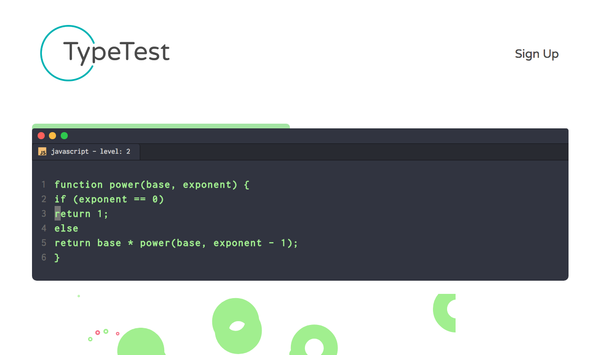

# TypeTest

Typetest is a typing game for programmers! Whether you are looking to type for fun or to gain some real insight into your typing habits, Typetest provides it all.

## Features

* Create a profile and track your recent results
* Choose to hone your skills in Ruby or JavaScript(More TBA)
* See your end of round statistics, including characters-per-minute and accuracy
* Be notified of every missed key
* Designed to look and feel like your text editor!

## Installation

* Clone this repo
* Create a file in the "App" directory named: `api-keys.ts` and export your firebase credentials as "masterFirebaseConfig"
* Seed your firebase database with "seed-data.json" located in the root directory
* Run the following commands in the terminal within the project root directory:

`npm install`

`bower install`

`npm start`

* Navigate to localhost:4200 in the browser

## Live Site

`live site at https://type-test-33c14.firebaseapp.com`

## Planned features

* Leaderboards
* Complete round history
* Authentication
* Multiplayer
* Custom Code

## Authors

* Kai de Rochemont
* Jason Ainsworth
* Monique St. Laurent
* Mohamed J Warsame

## License

MIT License

Copyright (c) Kai deRochemont, Jason Ainsworth, Monique St. Laurent, Mohamed J Warsame

Permission is hereby granted, free of charge, to any person obtaining a copy
of this software and associated documentation files (the "Software"), to deal
in the Software without restriction, including without limitation the rights
to use, copy, modify, merge, publish, distribute, sublicense, and/or sell
copies of the Software, and to permit persons to whom the Software is
furnished to do so, subject to the following conditions:

The above copyright notice and this permission notice shall be included in all
copies or substantial portions of the Software.

THE SOFTWARE IS PROVIDED "AS IS", WITHOUT WARRANTY OF ANY KIND, EXPRESS OR
IMPLIED, INCLUDING BUT NOT LIMITED TO THE WARRANTIES OF MERCHANTABILITY,
FITNESS FOR A PARTICULAR PURPOSE AND NONINFRINGEMENT. IN NO EVENT SHALL THE
AUTHORS OR COPYRIGHT HOLDERS BE LIABLE FOR ANY CLAIM, DAMAGES OR OTHER
LIABILITY, WHETHER IN AN ACTION OF CONTRACT, TORT OR OTHERWISE, ARISING FROM,
OUT OF OR IN CONNECTION WITH THE SOFTWARE OR THE USE OR OTHER DEALINGS IN THE
SOFTWARE.
